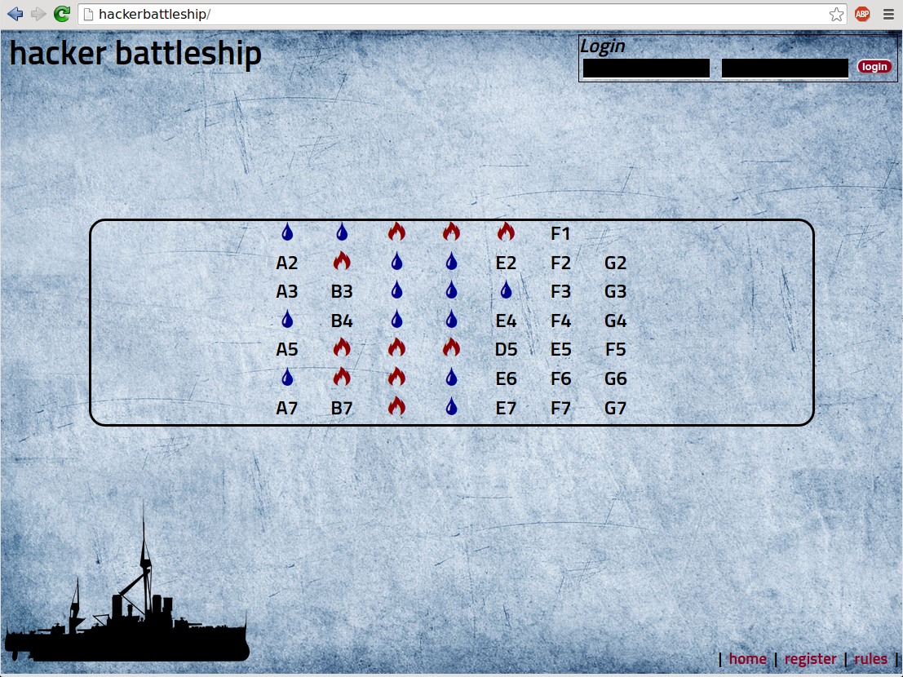

# Hacker Battleship - A CTF Engine
Copyright 2013 - 2015, Jason Ross <algorythm@gmail.com>

This is the hacker battleship CTF engine that's used by <a
href="http://bsidesroc.com">BSidesROC</a>.

*Screenshot:*

## Status
Currently being ported from PHP to Node.js. Sadly, I didn't think to make a
branch for the rewrite, and instead blew away the PHP version. oops.

## Description
* “The House” has a 7×7 battleship grid laid out
* Each coordinate on the grid is tied to a hacking challenge.
* All of the teams work to sink all of The House’s ships.
* When a challenge is solved, the corresponding coordinate is
  revealed as either a hit or a miss.
  - Additionally, the challenge closes, making it unavailable
    for other teams to solve.
* Points are awarded thus:
  - solving a challenge: points based on challenge worth
  - hitting a ship: 5 points
  - sinking a ship: 10 points
* In addition to the grid challenges, the game supports bonus
  challenges which are independent of the grid.
  - These are worth 10 points each.
  - Unlike the grid challenges, bonus challenges do not close
    when solved (though each team can solve them only once).

